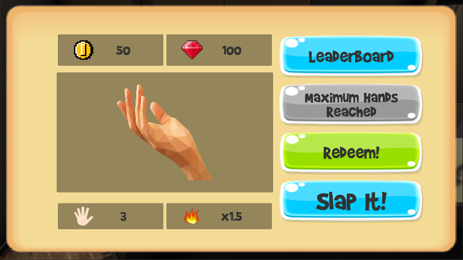

# SlapItToCookIt

Slap it to cook it is a super casual clicker game made in Unity3D and using Playfab and its online services. The main goal of this game is cooking a chicken only by slapping it, this may sound weird but it's actually possible, as you can see in the following video (very inspirational):

### [Consider playing it in itch.io - Sacred Forest](https://salmonsimon.itch.io/slap-it-to-cook-it)

## Login Menu

Starting the game, we will be received by three options, login for the ones who already have a created account, register for those who are playing for the first time and want to create a new account and guest login, which will use the device ID as the account identifier.

<picture>

</picture>

If *Guest Login* is pressed you'll be sent to the next scene, which has the main menu and the shop UI.

### Login Panel

<picture>

</picture>

### Register Panel

<picture>

</picture>

## Main Menu

<picture>

</picture>

After login we are welcomed with these three options: **Play** which will lead us to the shop UI, **Settings** which let us configure the music and sound effects volume ([see Settings](./Readme.md##Settings)) and finally the **Quit** button, which will shut down the application.

### Shop UI

After pressing the **Play** button, we will be redirected to the shop panel, where we can buy upgrades for our slaps, check the leaderboard (see Leaderboard) or play the game by pressing the *Slap It* button.

<picture>

</picture>

<picture>

</picture>

## Gameplay

When starting the gameplay scene you'll be shown the following:

<picture>

</picture>

This will prevent the time to run until we tap the screen for the first time, then starting the counters for time and slaps.

<picture>

</picture>

Sometimes random comic burst images will be shown to add dynamism as shown above, also, all slaps are accompanied by camera shake.

## Leaderboard

<picture>

</picture>

All record scores are saved for each player and can be seen on the leaderboard. The leaderboard ranking is increasing based on the field "RecordTime", i.e., the lower the number better the ranking.

On both sides of the *Back* button we see squared buttons which will display the previous or next batch of five players in our leaderboard, if there are no more entries to show, an error message will pop up.

## Settings

<picture>

</picture>

As explained before, on the settings menu we can change the volume of music and sound effects (SFX) sepparately. These values are saved internally on the device the player is using.

## Pause

<picture>

</picture>

When in gameplay, you can access the pause menu by clicking the pause button, which will stop the time and where you can then *Resume*, check your *Settings* or finally go back to the *Main Menu*.
